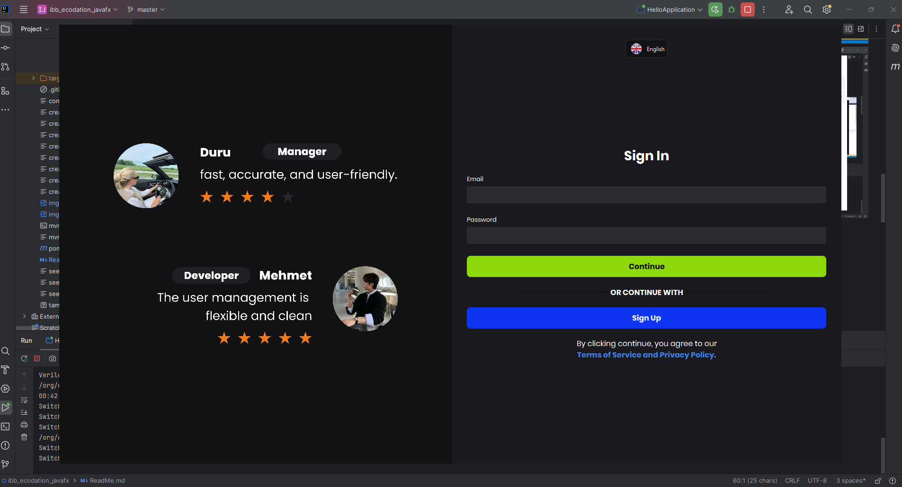
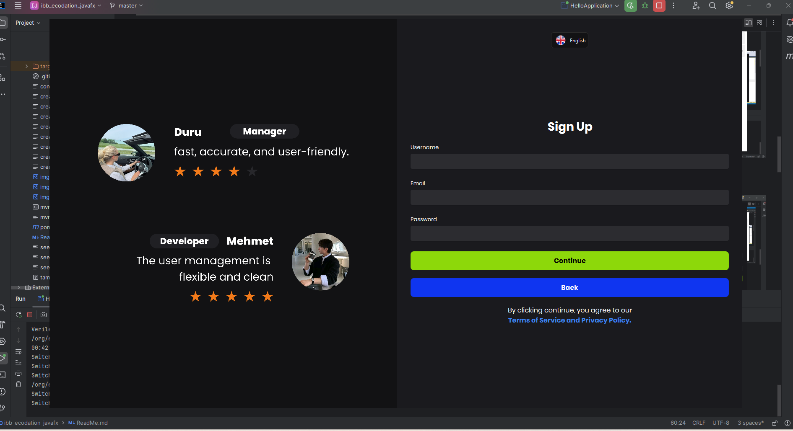
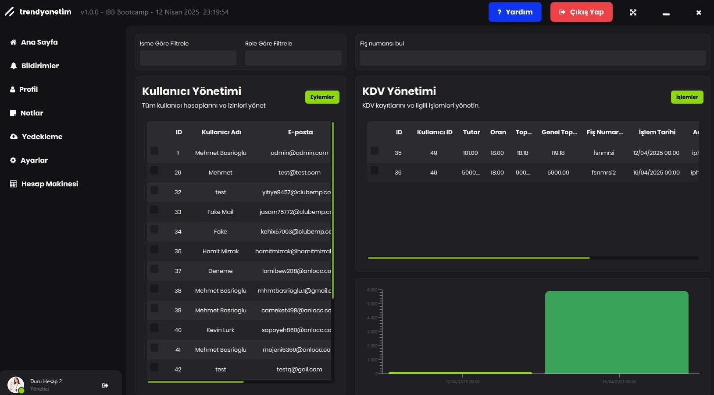
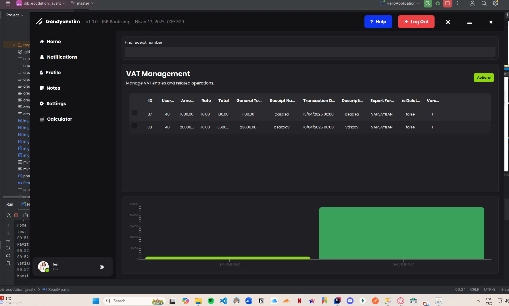
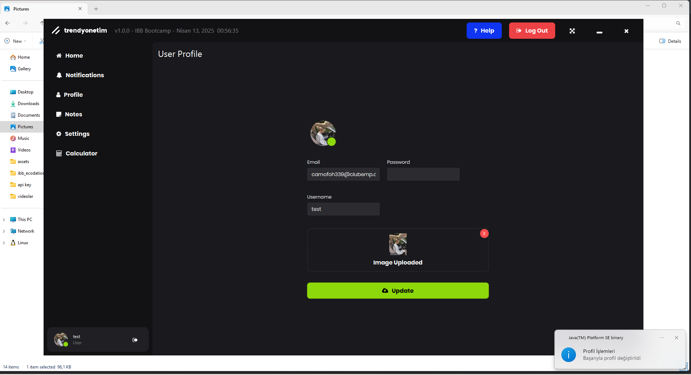
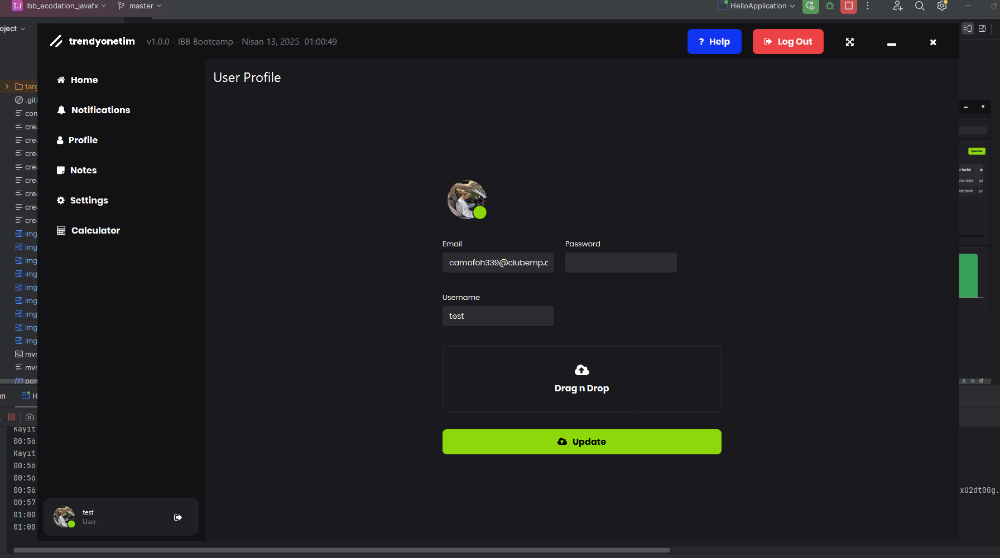
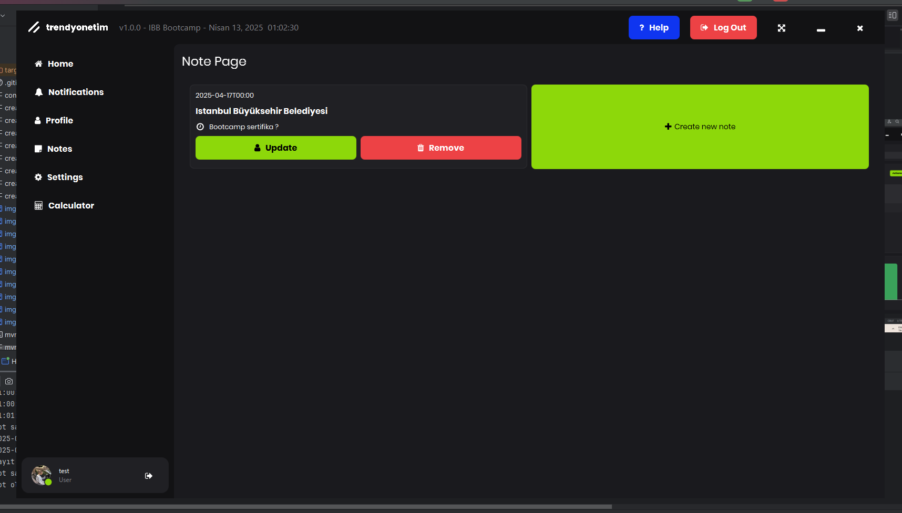
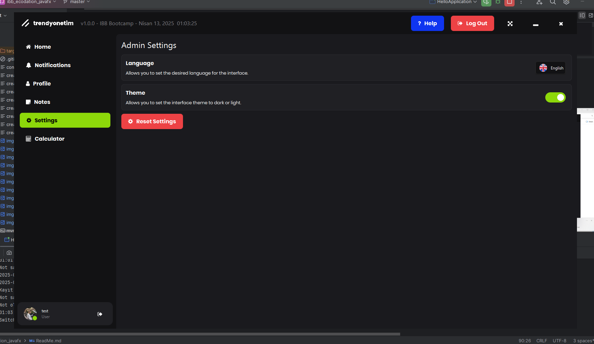
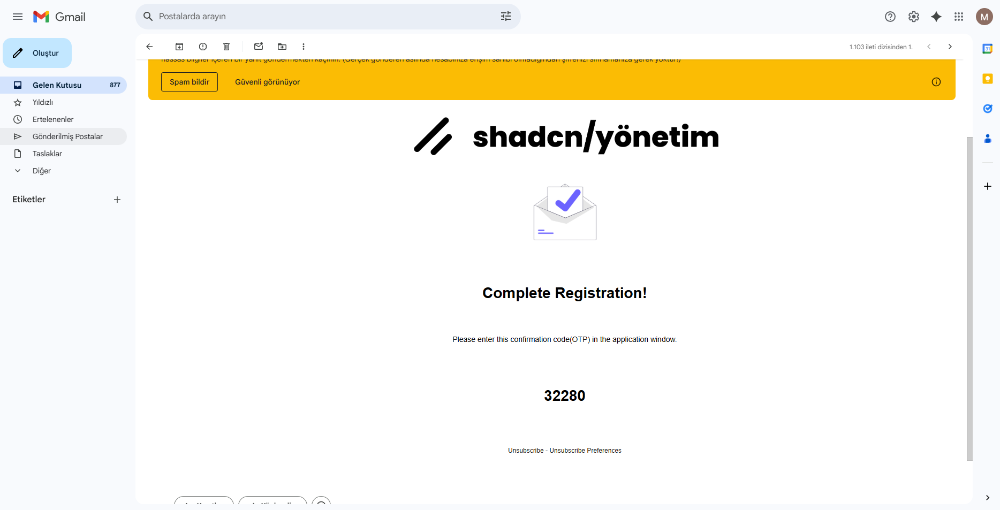
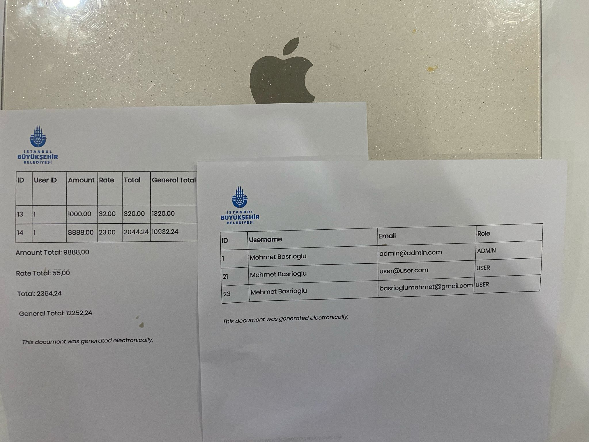

# Project Objective:
The goal is to develop a desktop application based on JavaFX, which includes functionalities such as VAT calculations, user management, and system settings.

# Actions Taken in the Project:

1. **Authentication & Authorization**
2. **Bcrypt Encryption**
3. **User Management & VAT Management**
4. **Filter Operations**
5. **Export to PDF, TXT, or Excel**
6. **Send mail to the target email via SendGrid API**
7. **Print data to the printer feature**
8. **Chart Graphics**
9. **Database First Approach**
10. **User Notifications stored in the database as a model**
11. **Profile Management**
12. **Animated Notes**
13. **Animated Scene Loader**
14. **Redux-based State Management**
15. **MsSQL RDMS (Relational Database Management System)**
16. **Inversion of Control (IoC)**
17. **MVC Architecture with Layered Design**
18. **User Document (WebView Integration)**
19. **Dark/Light Mode Toggle**
20. **Internationalization (i18n)**
21. **Custom Components inspired by shadcn**
22. **Log4j and Security Logging**
23. **Custom Annotations to Enhance Development**
24. **Modular Database Connection (supports MSSQL or H2)**
25. **MapStruct for Object Mapping**
26. **Custom Validation System similar to FluentValidation**
27. **Optimistic Locking**
28. **User OTP (One-Time Password) Verification**
29. **Native Notifications**
30. **Backups (Currently in Development)**
31. **Responsive Layouts**
32. **Custom Movable Scenes**
33. **Custom GUI Animations**
34. **Spring Framework**
35. **Factory Pattern**
36. **Singleton Pattern**
37. **Application Constants for Reusable Infrastructure**
38. **Apache POI**
39. **Jackson Serialization**
40. **Dynamic Guide**
41. more...

# UI Introduction
## Quick Video

https://github.com/user-attachments/assets/f1618cc7-8f7d-464d-9642-5824c789ec91

## Dark / Light Mode

## Authentication Page

## Home Page

### Staff view

### User view

## User Notifications (Native and DB)

1. Users can view **error**, **information**, and other types of notifications.
2. **Success**: Displays a tick icon to the user.
3. **Info**: Displays an "i" icon.
4. **Error**: Displays an "X" icon.
5. **Real-time native notifications** are sent and also saved to the **database**.

## User Profile

Displays the current user's information and provides profile management features.

## User Notes

1. Users can set a timer for a specific time.
2. Users can create and remove notes.

## Application Configs

1. Users can change the UI language.
2. Users can change the UI theme.
3. Users can reset configurations.

## User Guide

### Mail Sending

### Printer Feature
